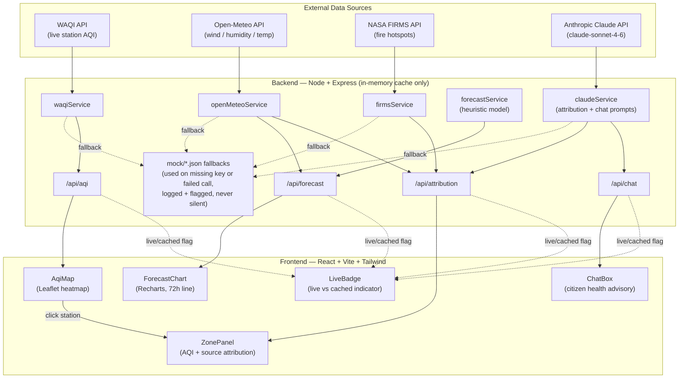

# AirSense — Architecture

## Data flow, in words

1. **Map load** — the frontend calls `GET /api/aqi?city=Bengaluru`. The backend asks `waqiService` for stations in the city's bounding box; if `WAQI_TOKEN` is unset or the call fails, it transparently falls back to `data/mock/waqi_bengaluru.json` and marks the response `live: false`.
2. **Zone selection** — clicking a station on the map triggers two backend calls in parallel:
   - `GET /api/forecast` — pulls Open-Meteo wind/humidity/temp for that point (or mock), then runs it through the heuristic `forecastService` to produce a 72h AQI curve.
   - `POST /api/attribution` — pulls the same weather data plus NASA FIRMS fire-hotspot count near the point, builds a signal summary, and sends it to Claude with a strict-JSON prompt for source attribution.
3. **Chat** — the citizen types a question; the backend forwards it to Claude along with the selected zone's current AQI and forecast summary, and Claude replies in the same language the question was asked in.
4. **Transparency** — every backend response that could be live-or-mocked carries a `live: boolean` flag. The frontend's `LiveBadge` component surfaces this everywhere, so cached/mock data is never silently presented as live.

## Why no database

Per the brief, this is a single-session hackathon prototype. All API responses are cached in-memory (`services/cache.js`, simple TTL map) for the life of the Node process — nothing persists across restarts, and there's no user data to persist anyway (no auth).
